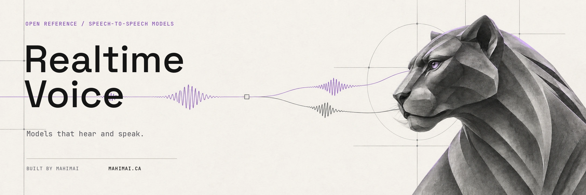

<div align="center">

<picture>
<source media="(prefers-color-scheme: dark)" srcset="docs/assets/banner-dark.webp">
<source media="(prefers-color-scheme: light)" srcset="docs/assets/banner-light.webp">

</picture>

**Set of 📝 with 🔗 for those building on realtime speech models 🗣️⚡**

A curated reference for choosing a speech model, understanding its conversation controls, and finding a working implementation.

[Voice AI learning path](https://github.com/mahimairaja/voiceai) · [Voice AI Skills](https://github.com/mahimailabs/voice-ai-skills) · [Contribute](CONTRIBUTING.md) · [MIT license](LICENSE)

</div>

## 🧭 0. Start here

This is for engineers building with models that understand speech directly. It covers hosted speech-to-speech APIs, their controls, and selected open weights. [voiceai](https://github.com/mahimairaja/voiceai) covers the wider stack: STT, TTS, frameworks, transport, and telephony. [voice-ai-skills](https://github.com/mahimailabs/voice-ai-skills) packages engineering judgment for coding agents.

Read the architecture section, compare the controls, then open the notes for two candidates. Try both on the same conversations before choosing.

Resource tags describe prerequisites: **🟢 Beginner**, **🟡 Intermediate**, **🔴 Advanced**. They are not model rankings.

**Evidence:** reviewed on **2026-09-15** against documentation and source repositories. No model calls were run for this edition. “Documented” is not “tested”; “unverified” is not “unsupported.” Model, integration, and price rows carry last-verified dates. If a date is older than 60 days, check the source before you build on it.

## 📑 Contents

1. [What realtime means](#-1-what-realtime-means)
2. [Model comparison](#-2-model-comparison)
3. [Controls that change your architecture](#-3-controls-that-change-your-architecture)
4. [Choosing a pipeline](#-4-choosing-a-pipeline)
5. [Model notes](#-5-model-notes)
6. [Integrations and transport](#-6-integrations-and-transport)
7. [Evaluation and benchmarks](#-7-evaluation-and-benchmarks)
8. [Pricing](#-8-pricing)
9. [Research and open weights](#-9-research-and-open-weights)
10. [Hands-on examples](#-10-hands-on-examples)
11. [Maintenance and contributing](#-11-maintenance-and-contributing)

## 🧩 1. What realtime means

Two questions describe the system: **what processes the audio**, and **how listening and speaking overlap**. A streaming connection alone does not establish full-duplex model behavior.

```text
Audio paths

Cascade:       audio -> STT -> text LLM -> TTS -> audio
Half-cascade:  audio -> speech model -> text -> TTS -> audio
Native S2S:    audio -> speech model -> audio

Conversation behavior

Turn-based:    user speaks -> response starts -> user can interrupt
Full-duplex:   user audio  =============================>
              model audio <==============================
              listening and speaking can overlap continuously
```

The half-cascade requires a text response mode. Full-duplex adds simultaneous listening and speaking; it does not specify which API controls you receive. See [LiveKit’s pipeline definitions][lk-pipelines] and [OpenAI’s Realtime-to-Live comparison][oai-migration].

**The question that decides your architecture is who owns the turn.** Break that into endpoint detection, response initiation, generation cancellation, playback, and conversation history.

## 📊 2. Model comparison

These are selected hosted offerings with public documentation and pricing. OpenAI’s Realtime and Live APIs are separate products. Ultravox’s hosted service includes speech output; its open model emits text. Exact identifiers and qualifications are in [model notes](#-5-model-notes).

### Conversation controls

The cells below describe the native API or hosted service, unless explicitly labeled as an integration. Each linked source supports the adjacent behavior.

| Model / service | Starting a response | Interruption and history | Last verified |
| --- | --- | --- | --- |
| [OpenAI Realtime 2.1][oai-model] | [Server/semantic VAD][oai-vad] or [application-triggered responses][oai-conv]. | [Cancel generation; truncate unheard output. WebSocket clients manage playback and truncation][oai-conv]. | 2026-09-15 |
| [OpenAI GPT-Live 1][live-model] | [Voice model decides when to speak; `response.create` triggers backend work][oai-migration]. | [Playback can be blocked][live-controls]. [LiveKit documents no model-history truncation][lk-live]. | 2026-09-15 |
| [Gemini 3.8 Live][gem-model] | [Automatic VAD or explicit activity boundaries][gem-cap]. | [VAD interruption cancels generation; client clears playback. History can include audio sent but not heard][gem-cap]. | 2026-09-15 |
| [Amazon Nova 2 Sonic][nova-model] | [Model endpointing with configurable sensitivity][nova-input]. | [Barge-in stops generation; client clears its queue][nova-output]. [History is seeded before audio starts][nova-history]. | 2026-09-15 |
| [Grok Voice Think Fast 2.0][grok-guide] | [Server VAD or manual input commit and response creation][grok-guide]. | [`response.cancel`, item deletion, and assistant-audio truncation][grok-reference]. | 2026-09-15 |
| [Ultravox Realtime][uv-news] | [Hosted VAD with endpoint and interruption settings][uv-vad]. | [Forced messages can be uninterruptible; immediate user text can interrupt][uv-messages]. Arbitrary history deletion: unverified. | 2026-09-15 |

Gemini’s Extended Thinking variant shares the audio controls but changes how you track completion. See its [model note](#gemini-38-live-and-extended-thinking).

### Text output and tool execution

“Text-only” means generating the reply as text for your own speech output. An audio transcript does not establish that capability. For custom functions, distinguish **which model selects a tool** from **the code that executes it**.

| Model / service | Text-only reply | Custom tool path | Last verified |
| --- | --- | --- | --- |
| OpenAI Realtime 2.1 | [Supported][oai-conv]. | [Realtime model selects; your application executes][oai-migration]. | 2026-09-15 |
| OpenAI GPT-Live 1 | [Not supported by the LiveKit plugin][lk-live]; native independent text-only mode unverified. | [Responses delegation: backend selects, your application executes. Client delegation: your backend handles the work][live-delegation]. | 2026-09-15 |
| Gemini 3.8 Live | [Audio response mode with optional transcripts][gem-model]. | [Model requests functions; your application executes. Extended Thinking requires nonblocking tools][gem-thinking]. | 2026-09-15 |
| Amazon Nova 2 Sonic | Unverified; text output events alone are insufficient evidence. | [Model selects; your application executes and returns results; asynchronous tools supported][nova-tools]. | 2026-09-15 |
| Grok Voice Think Fast 2.0 | Unverified; text input and transcript events are documented. | [Agent selects; your application executes custom functions. Provider tools use separate server-side paths][grok-guide]. | 2026-09-15 |
| Ultravox Realtime | [Switch output between voice and text][uv-messages]. | [Agent selects; HTTP tools execute on your server, client tools in your application][uv-tools]. | 2026-09-15 |

## 🎛️ 3. Controls that change your architecture

### Endpointing and response initiation

A silence threshold, an explicit “respond now” command, and a continuously speaking model expose different interfaces. Realtime permits explicit response creation. GPT-Live’s similarly named event starts delegated work. Treat event names as protocol-specific. [API comparison][oai-migration].

### Barge-in and playback

Stopping sound locally can leave the model believing the caller heard the whole response. Record both generated audio and played audio. In Realtime over WebSocket, cancel and truncate against playback position; in GPT-Live’s documented LiveKit integration, the missing truncation control remains a limitation. [Realtime playback][oai-conv], [GPT-Live integration][lk-live].

### Uninterruptible segments and exact read-backs

Separate “read these words” from “do not stop this segment.” Grok’s `force_message` with `interruptible: false` drops caller audio during that playback. Ultravox exposes `forced_agent_message` with `uninterruptible: true`. These are specific controls, not evidence that every generated response has the same guarantee. [Grok controls][grok-guide], [Ultravox messages][uv-messages].

### Tool visibility and work in progress

Under GPT-Live Responses delegation, voice instructions explain when to delegate; backend instructions guide reasoning and tool selection. An interruption does not automatically cancel backend work. Gemini Extended Thinking can speak interim updates while work continues: track `interaction_status`, not just `turnComplete`. [GPT-Live delegation][live-delegation], [Gemini thinking][gem-thinking].

### Context, persona, and voice

Appending a correction is different from deleting history. Starting another session is different from changing the current one. GPT-Live keeps its original voice/persona while accepting appended context; its native API permits some backend updates that LiveKit’s guide restricts. Realtime lets you update session settings, but its voice is fixed after the first audio output. [Live sessions][live-conv], [delegation][live-delegation], [LiveKit guide][lk-live], [Realtime sessions][oai-conv].

## 🔀 4. Choosing a pipeline

These are starting hypotheses for your own evaluation, not universal model rankings. The control distinctions above and [pipeline guide][lk-pipelines] explain the tradeoffs.

| Need | Start by evaluating | What to establish |
| --- | --- | --- |
| Exact numbers, names, or read-backs | Controlled TTS or documented forced speech. | The required words were actually played and understood. |
| Required disclosure or scripted wording | An application-controlled speech segment. | Completion, pronunciation, interruption policy, and a recoverable restart. |
| Supervisor needs a live transcript | A cascade, or a speech API with suitable transcript events. | Transcript delay and corrections under overlap; distinguish raw deltas from framework turns. |
| Cost-sensitive deployment | A small-model cascade and a realtime candidate. | Measured billable usage over your conversation lengths, including silence and tools. |
| Frequent caller interruptions | Configurable realtime and full-duplex candidates. | Yield time, false interruptions, and history consistency after playback stops. |
| Expressive or emotionally nuanced conversation | Native speech-to-speech. | Human preference and task success on representative conversations. |
| Language switching mid-call | Candidates with documented support for the required languages. | Accents, mixed-language numbers, names, and recovery after recognition errors. |
| Video or screen input | A model and integration exposing visual input. | The selected API mode, frame handling, and connection/session limits. |

## 🗒️ 5. Model notes

### OpenAI Realtime 2.1

Use `gpt-realtime-2.1`; `gpt-realtime-2.1-mini` has a separate price. The older `gpt-realtime` is deprecated, with replacement guidance in the [deprecation schedule][oai-deprecations].

The API exposes turn controls, text-only output, and custom functions. The model page lists text, audio, and image inputs. WebSocket clients must reconcile interrupted playback with model history. The documented session limit is 60 minutes. [Model card][oai-model], [conversation guide][oai-conv].

- 🟢 [WebRTC quickstart][oai-webrtc]: Connect a browser to the Realtime API.
- 🟡 [Conversation controls][oai-conv]: Response creation, interruption, session updates, and truncation.
- 🟡 [Cost accounting][oai-cost]: Understand cached input and repeated conversation context before estimating a call.

[Pricing](#-8-pricing) · [Release notes][oai-changelog]

### OpenAI GPT-Live 1

`gpt-live-1` is the full-duplex voice frontend. It can delegate to a Responses model or your own backend. OpenAI records API general availability on September 10, 2026. [Model card][live-model], [release notes][oai-changelog].

**Gotcha:** distinguish the native protocol from LiveKit’s adapter. Native transcript deltas can arrive while speech is streaming; the adapter documents completed conversation items after speech. Native Responses delegation accepts backend configuration updates; the adapter guide restricts backend instruction changes and still mentions alpha access. These documentation differences remain untested here. [Native sessions][live-conv], [delegation][live-delegation], [adapter guide][lk-live].

- 🟢 [GPT-Live WebRTC quickstart][live-webrtc]: Start a native Live session.
- 🟡 [Delegation guide][live-delegation]: Choose your backend and handle work that can outlive an interruption.
- 🔴 [LiveKit GPT-Live guide][lk-live]: Read the adapter’s playback, context, handoff, and transcript limitations.

[Pricing](#-8-pricing) · [Release notes][oai-changelog]

### Gemini 3.8 Live and Extended Thinking

The model IDs are `gemini-3.8-live` and `gemini-3.8-live-extended-thinking`. Both model pages label them stable. Standard Live and Extended Thinking have different completion/tool lifecycles; the latter uses `interaction_status` for ongoing work. [Standard model][gem-model], [Extended Thinking model][gem-ext], [thinking guide][gem-thinking].

**Gotcha:** a spoken utterance ending does not necessarily mean background work is done. LiveKit’s reviewed plugin guide describes earlier Gemini versions; Pipecat’s guide describes the family, but these links do not establish full 3.8 Extended Thinking compatibility. [LiveKit][lk-gem], [Pipecat][pc-gem].

- 🟢 [Live API overview][gem-live]: Native WebSocket setup and partner connection options.
- 🟡 [Capabilities][gem-cap]: Audio formats, VAD, interruption, transcripts, and supported languages.
- 🔴 [Session management][gem-sessions]: Compression, connection rotation, and resumption for long conversations.

The catalog still lists 2.5 native-audio preview; use the [model catalog][gem-catalog] to distinguish older tutorials from current model IDs. [Pricing](#-8-pricing) · [Release notes][gem-changelog]

### Amazon Nova 2 Sonic

`amazon.nova-2-sonic-v1:0` runs through Amazon Bedrock’s bidirectional streaming API. It supports asynchronous tool use and accepts PCM audio at documented sample rates. [Model card][nova-model], [input events][nova-input], [tools][nova-tools].

**Gotcha:** connections last at most eight minutes, so long calls need continuation. `SPECULATIVE` text previews speech; `FINAL` output accounts for completion or interruption. Do not use speculative wording as proof that a caller heard it. [Session guide][nova-overview], [output events][nova-output].

- 🟢 [Conversational speech guide][nova-overview]: Start with Nova 2 Sonic’s event-based interface.
- 🟡 [Tool configuration][nova-tools]: Function schemas, tool choice, and asynchronous execution.
- 🟡 [Conversation history][nova-history]: Load prior conversation before streaming starts.

[Pricing](#-8-pricing) · [Release notes][nova-changelog]

### Grok Voice Think Fast 2.0

Use `grok-voice-think-fast-2.0`; `grok-voice-latest` is a moving alias. The API exposes manual or automatic turns, custom functions, transcript events, and forced speech. [Guide][grok-guide], [event reference][grok-reference].

**Gotcha:** the price meters audio sent and received, plus certain client text events. It is not a flat elapsed-session price. LiveKit’s reviewed guide still defaults to the older 1.0 model. Pin the model explicitly and check your adapter’s accepted options. [Pricing source][grok-pricing], [LiveKit guide][lk-grok].

- 🟢 [Speech-to-speech guide][grok-guide]: Connect, choose formats, and respond to tool requests.
- 🟡 [Voice event reference][grok-reference]: Cancellation, transcript deltas, and conversation-item operations.
- 🟡 [Native SIP integration][grok-sip]: Check the model service’s phone connection path.

[Pricing](#-8-pricing) · [Release notes][grok-changelog]

### Ultravox Realtime

The hosted default documented in the release notes is `ultravox-v0.7`. Ultravox’s open model accepts audio and emits text; the hosted service supplies the speech output and call controls compared here. [Hosted release notes][uv-news], [open-model repository][uv-code].

**Gotcha:** switching to open weights does not reproduce the whole hosted service. Check speech output, tool execution, and transport separately. Hosted data messages expose voice/text output switching, transcript updates, and forced agent messages. [Data-message protocol][uv-messages].

- 🟢 [Call API][uv-calls]: Create a hosted session and inspect its configuration.
- 🟡 [Data messages][uv-messages]: Text output, transcripts, and controlled utterances.
- 🟡 [HTTP versus client tools][uv-tools]: Choose where your functions execute.

[Pricing](#-8-pricing) · [Release notes][uv-news]

## 🔌 6. Integrations and transport

These are **integration guides**, not a guarantee that every current model feature is exposed. Check exact IDs, package versions, and delegation modes. Vapi, LiveKit, and Pipecat are integrations; WebRTC, WebSocket, and Bedrock streaming are connection interfaces.

| Model family | LiveKit guide | Pipecat guide | Version caveat | Last verified |
| --- | --- | --- | --- | --- |
| OpenAI Realtime | [Plugin][lk-oai] | [Service][pc-oai] | Check the selected model ID and VAD defaults. | 2026-09-15 |
| OpenAI GPT-Live | [Plugin][lk-live] | [Service][pc-live] | Native API and adapter differ on delegation defaults and updates. | 2026-09-15 |
| Gemini Live | [Plugin][lk-gem] | [Service][pc-gem] | 3.8 Extended Thinking lifecycle support unverified. | 2026-09-15 |
| Nova 2 Sonic | [Plugin][lk-nova] | [Service][pc-nova] | Both guides name Nova 2; check session continuation. | 2026-09-15 |
| Grok Voice | [Plugin][lk-grok] | [Service][pc-grok] | LiveKit’s documented default is older than xAI’s current model. | 2026-09-15 |
| Ultravox | [Plugin][lk-uv] | [Service][pc-uv] | These target the hosted service. | 2026-09-15 |

Vapi’s [Realtime guide][vapi-realtime] documents an older model roster, while its [OpenAI provider page][vapi-openai] lists Realtime 2. Current 2.1 and GPT-Live availability through Vapi remain unverified in this edition.

### Audio at the API boundary

Codec acceptance does not establish accuracy on a phone call. Resampling changes the sample rate; it cannot recover missing speech detail.

| Service | Direct connection | Documented narrowband path | Last verified |
| --- | --- | --- | --- |
| OpenAI Realtime | [WebRTC, WebSocket, SIP][oai-conv] | [G.711 μ-law/A-law][oai-schema]. | 2026-09-15 |
| GPT-Live | [WebRTC][live-webrtc], [WebSocket][live-ws] | [8 kHz G.711 μ-law/A-law over WebSocket][live-ws]. | 2026-09-15 |
| Gemini Live | [WebSocket; partner WebRTC][gem-live] | [PCM input is resampled; output is 24 kHz PCM][gem-cap]. Native G.711 unverified. | 2026-09-15 |
| Nova 2 Sonic | [Bedrock bidirectional stream][nova-model] | [8 kHz PCM supported][nova-input]. | 2026-09-15 |
| Grok Voice | [WebSocket][grok-guide], [SIP][grok-sip] | [8 kHz PCM and G.711][grok-guide]. | 2026-09-15 |
| Ultravox Realtime | [WebRTC / WebSocket][uv-ws], [SIP][uv-sip] | [SIP supports 8 kHz PCMU/PCMA][uv-sip]. | 2026-09-15 |

For WebRTC fundamentals, SIP trunks, and Twilio Media Streams bridges, use [voiceai’s transport and telephony sections](https://github.com/mahimairaja/voiceai#-8-webrtc-fundamentals).

## ✅ 7. Evaluation and benchmarks

Use benchmarks to select candidates. Use your own recorded scenarios to choose a deployment. Check benchmark versions, model IDs, prompts, and transport before comparing scores.

| Resource | Measures | Boundary |
| --- | --- | --- |
| 🟢 [Artificial Analysis Speech-to-Speech][aa-speech] | Reasoning, agentic performance, preference, and other published components. | The index methodology changes; it does not measure your complete application. |
| 🟡 [Big Bench Audio and methodology][aa-method] | Reasoning on spoken questions and response speed. | Question answering does not establish multi-turn task completion. |
| 🟡 [τ-Voice][tau-voice] | Tool-backed customer-service tasks through native audio providers. | Simulated domains and provider adapters constrain what a score means. |
| 🟡 [τ banking knowledge domain][tau-banking] | Retrieval and customer-service task outcomes. | State the voice configuration and dataset version; do not equate a text run with a voice result. |
| 🟢 [Speech Agent Arena][aa-speech] | Human preference in live voice conversations. | Preference does not prove factual correctness or reliable tool execution. |
| 🔴 [Full-Duplex-Bench][fdb] | Pause/overlap handling, dynamic conversations, and tool use across different versions. | Report the version; the offline, live-examiner, and disfluency tasks are different experiments. |

### Run your own

- 🟡 [LiveKit simulations][lk-sim]: Text mode checks logic; audio mode exercises the speech path. Check model compatibility before interpreting a run.
- 🟡 [LiveKit test framework and JudgeGroup][lk-tests]: Assert on tools, conversation results, and application state; text assertions do not prove playback timing.
- 🟡 [Pipecat Evals][pc-evals]: Scripted or simulated callers with text/audio modes; its docs require audio mode for speech-to-speech agents.
- 🟡 [Vapi simulations][vapi-sim]: Run complete conversations; supplement conversation criteria with tool results and final application state.

For a first comparison, repeat these scenarios with the same prompt, tools, transport, and audio:

1. A caller pauses halfway through a number, then corrects it.
2. A short “mm-hmm,” a cough, and a genuine interruption occur during speech.
3. A tool takes several seconds, fails, or returns after the caller changes the request.
4. The agent must read a fixed reference number and get confirmation.
5. A caller switches between your target languages mid-sentence.
6. The session reconnects after a long conversation.

Capture input audio, played output, transcript revisions, timestamped events, tool traces, final application state, and usage. Grade what happened as well as what the agent said. Record trial counts and latency percentiles; label observations as tested only when the reproduction is available.

## 💵 8. Pricing

**USD list prices, reviewed 2026-09-15.** Token rates below are per **one million tokens**. Rates are for the named native API or hosted service, before taxes, platform fees, carrier charges, and separately billed tools. AWS rates are for on-demand use in `us-east-1`.

Prices change. The date is the claim.

### Token-metered services

| Model | Audio input / output | Text input / output | Source | Last verified |
| --- | --- | --- | --- | --- |
| `gpt-realtime-2.1` | $32 / $64 | $4 / $24 | [OpenAI][oai-pricing] | 2026-09-15 |
| `gpt-realtime-2.1-mini` | $10 / $20 | $0.60 / $2.40 | [OpenAI][oai-pricing] | 2026-09-15 |
| `gemini-3.8-live` | $3 / $12 | $0.75 / $4.50 | [Google][gem-pricing] | 2026-09-15 |
| `gemini-3.8-live-extended-thinking` | $3 / $12 | $0.75 / $4.50 | [Google][gem-pricing] | 2026-09-15 |
| `amazon.nova-2-sonic-v1:0` | $3 / $12 | $0.33 / $2.75 | [AWS pricing][aws-pricing], [rate data][aws-rates] | 2026-09-15 |

OpenAI cached-input rates differ: Realtime 2.1 charges $0.40 per million cached audio or text input tokens; Mini charges $0.30 for cached audio and $0.06 for cached text. Images, transcription, backend work, and provider tools can add other meters. Google’s text output pricing includes thinking tokens. [OpenAI pricing][oai-pricing], [Google pricing][gem-pricing].

### Duration and event meters

| Service | Meter | Listed rate | Source | Last verified |
| --- | --- | --- | --- | --- |
| GPT-Live 1 | Connected session duration, including silence; billed per second. | $0.05/minute, plus backend and tools. | [OpenAI][oai-pricing], [cost guide][oai-cost] | 2026-09-15 |
| Grok Voice Think Fast 2.0 | Audio sent **plus** audio received; certain client text events. | $0.08/audio minute + $0.004/client text message. Tool-result messages excluded. | [xAI][grok-pricing] | 2026-09-15 |
| Ultravox Realtime PAYGO | Call duration, in six-second billing increments. | $0.05/minute including hosted TTS; SIP costs extra. | [Pricing][uv-pricing], [billing FAQ][uv-faq], [TTS inclusion][uv-home] | 2026-09-15 |

### What does a five-minute call cost?

Five minutes and two tool calls do not specify audio tokens, tool-result size, thinking, or cached context. The examples below are calculations under stated assumptions, not measured calls.

| Scenario | Calculation | What remains |
| --- | --- | --- |
| GPT-Live, exactly 300 billable session seconds | `300 / 60 × $0.05 = $0.25` | Backend tokens, tools, and connection/platform charges. |
| Ultravox PAYGO, exactly 300 billable seconds, included hosted voice | `50 × 6 / 60 × $0.05 = $0.25` | SIP, external tools, or an independently billed voice configuration. |
| Grok, 3 billed input-audio minutes + 2 output-audio minutes + 2 billable client text messages | `(3 + 2) × $0.08 + 2 × $0.004 = $0.408` | Provider tools and other service charges. Two tool calls are not the same as two billable text messages. |
| Token-metered model, five-minute session with two custom tool calls | `Σ(billed units × unit rate)` | Read every response’s usage, including history, tool context, caching, and applicable thinking. |

For an uncached, audio/text-only token example, let `Ai`, `Ao`, `Ti`, and `To` be the actual billed input/output audio and text token totals. Gemini 3.8 costs `(3Ai + 12Ao + 0.75Ti + 4.50To) / 1,000,000`; Nova 2 Sonic costs `(3Ai + 12Ao + 0.33Ti + 2.75To) / 1,000,000`. Use separate terms for every additional billing category. [Google rates][gem-pricing], [AWS rates][aws-rates].

## 🔬 9. Research and open weights

These projects publish inference code and weights. Availability was checked; local inference was not run. They are not all full-duplex models, and an open checkpoint is not equivalent to a hosted service. Read the code and weights licenses separately.

| Model | Shape and practical note | Paper / code / weights | Last verified |
| --- | --- | --- | --- |
| 🔴 Moshi | Full-duplex speech model; PyTorch, MLX, and Rust implementations. | [Paper](https://arxiv.org/abs/2410.00037) · [Code](https://github.com/kyutai-labs/moshi) · [Weights](https://huggingface.co/kyutai/moshika-pytorch-bf16) | 2026-09-15 |
| 🔴 PersonaPlex | Moshi-based full-duplex model with role prompts and voice conditioning. | [Paper](https://arxiv.org/abs/2602.06053) · [Code](https://github.com/NVIDIA/personaplex) · [Weights](https://huggingface.co/nvidia/personaplex-7b-v1) | 2026-09-15 |
| 🔴 Qwen3-Omni Instruct | Audio/video/text input with speech output; select Instruct for the speech-generating variant. | [Paper](https://arxiv.org/abs/2509.17765) · [Code](https://github.com/QwenLM/Qwen3-Omni) · [Weights](https://huggingface.co/Qwen/Qwen3-Omni-30B-A3B-Instruct) | 2026-09-15 |
| 🔴 Mini-Omni2 | Research audio/vision assistant with inference and chat demo code. | [Paper](https://arxiv.org/abs/2410.11190) · [Code](https://github.com/gpt-omni/mini-omni2) · [Weights](https://huggingface.co/gpt-omni/mini-omni2) | 2026-09-15 |

[Sesame CSM](https://github.com/SesameAILabs/csm) is a speech-generation component that needs a separate text-generating model. [Kyutai Unmute](https://github.com/kyutai-labs/unmute) is a cascade of STT, a text LLM, and TTS. Both are useful related work; neither is a substitute row for a native conversational API.

For the wider literature:

- 🟡 [Awesome Full-Duplex SDM](https://github.com/Ruiqi-Yan/Awesome-Full-Duplex-SDM): Categorizes dialogue models, components, and benchmarks.
- 🔴 [Awesome Speech Language Model](https://github.com/ddlBoJack/Awesome-Speech-Language-Model): Broader papers, code, and speech-language-model resources.
- 🔴 [Full-duplex S2S survey](https://github.com/cyrta/awesome-full-duplex-speech-to-speech): An early survey outline; several catalog sections remain placeholders at this review.

## 🛠️ 10. Hands-on examples

Prefer examples with code or recorded evidence. A runnable example demonstrates an integration path; it does not establish a production reliability score.

- 🟡 **GPT-Live:** [mahimailabs/gpt-live-voice-agent][own-demo]: Clinic-agent example comparing GPT-Live with a cascade, with read-back experiments and simulated callers.
- 🟡 **GPT-Live:** [GPT-Live on LiveKit: Five Voice Agent Rules That Just Broke][own-article]: Companion Medium article (member-only); the example code is free. Interpret its observations with the current API and plugin notes above.
- 🔴 **Native voice APIs:** [τ-Voice implementation][tau-voice]: Audio-native provider adapters and a reproducible evaluation entry point.
- 🔴 **Moshi:** [Local MLX inference](https://github.com/kyutai-labs/moshi#mlx-implementation-for-local-inference-on-macos): Run a published speech model locally and inspect the client/server path.
- 🔴 **Qwen3-Omni:** [Official cookbooks](https://github.com/QwenLM/Qwen3-Omni/tree/main/cookbooks): Executed notebooks for multimodal inputs and model-specific behavior.

**Disclosure:** this repository and the `mahimailabs` GPT-Live example and companion article are maintained or authored by Mahimai Raja. Vendor docs, framework guides, and independent evaluations are labeled by source throughout.

## 🔄 11. Maintenance and contributing

### What changed

**September 2026:** initial reference, dated API comparisons and pricing, model-specific integration caveats, and reproducible evaluation resources. See [CHANGELOG.md](CHANGELOG.md) for repository changes and each model’s release notes for vendor announcements.

### Needs verification

These are known evidence gaps, not negative capability claims:

- **Text-only replies:** establish native independent text-only generation for GPT-Live, Nova 2 Sonic, and Grok Voice. Transcript events are insufficient.
- **Gemini integrations:** reproduce 3.8 and Extended Thinking with pinned LiveKit/Pipecat versions, including background-work completion and interruption.
- **GPT-Live adapter:** reconcile its access label, backend-update restrictions, and transcript timing with native docs using a pinned implementation and event trace.
- **Grok adapter:** verify the 2.0 model and current forced-speech controls through each integration; do not rely on an older default.
- **Vapi roster:** verify current Realtime 2.1 and GPT-Live availability, beyond the older models shown in its guides.
- **Languages:** Google’s [overview][gem-live] and [capabilities][gem-cap] give different totals. Use the named language list and test required language pairs. No comparable, verified count is published here for every model.
- **History:** establish Ultravox’s arbitrary mid-session deletion behavior. Documented append or stage operations do not prove it.
- **Metering:** verify Grok’s silence accounting and tool/SIP extras, and Ultravox’s independently billed voice configurations, before using an all-in estimate.

### Discuss and contribute

Open an issue for corrections and new evidence using the [matrix correction template](.github/ISSUE_TEMPLATE/matrix-correction.md). For provider and framework questions, start with [voiceai’s community links](https://github.com/mahimairaja/voiceai#-19-communities).

**Every comparison needs a source supporting the exact claim.** Include the model ID, scope, date, and a reproducible setup for observed behavior. Disclose your affiliation. See [CONTRIBUTING.md](CONTRIBUTING.md) and the [matrix correction template](.github/ISSUE_TEMPLATE/matrix-correction.md).

Weekly link checks find unreachable pages. They cannot establish that a capability or price is still correct. Review the claims separately and retain disagreements until they are resolved.

---

[MIT](LICENSE). Contributions welcome.

[lk-pipelines]: https://docs.livekit.io/agents/models/pipelines/
[oai-model]: https://developers.openai.com/api/docs/models/gpt-realtime-2.1
[oai-migration]: https://developers.openai.com/api/docs/guides/live-migration
[oai-vad]: https://developers.openai.com/api/docs/guides/realtime-vad
[oai-conv]: https://developers.openai.com/api/docs/guides/realtime-conversations
[oai-schema]: https://developers.openai.com/api/reference/resources/realtime
[oai-pricing]: https://developers.openai.com/api/docs/pricing
[oai-cost]: https://developers.openai.com/api/docs/guides/voice-latency-cost
[oai-changelog]: https://developers.openai.com/api/docs/changelog
[oai-deprecations]: https://developers.openai.com/api/docs/deprecations
[oai-webrtc]: https://developers.openai.com/api/docs/guides/voice-webrtc?api=realtime
[live-model]: https://developers.openai.com/api/docs/models/gpt-live-1
[live-controls]: https://developers.openai.com/api/docs/guides/voice-server-controls?api=live
[live-delegation]: https://developers.openai.com/api/docs/guides/live-delegation
[live-conv]: https://developers.openai.com/api/docs/guides/live-conversations
[live-webrtc]: https://developers.openai.com/api/docs/guides/voice-webrtc?api=live
[live-ws]: https://developers.openai.com/api/docs/guides/voice-websockets?api=live
[gem-model]: https://ai.google.dev/gemini-api/docs/models/gemini-3.8-live
[gem-ext]: https://ai.google.dev/gemini-api/docs/models/gemini-3.8-live-extended-thinking
[gem-cap]: https://ai.google.dev/gemini-api/docs/live-api/capabilities
[gem-thinking]: https://ai.google.dev/gemini-api/docs/live-api/thinking
[gem-live]: https://ai.google.dev/gemini-api/docs/live-api
[gem-sessions]: https://ai.google.dev/gemini-api/docs/live-api/session-management
[gem-catalog]: https://ai.google.dev/gemini-api/docs/models
[gem-pricing]: https://ai.google.dev/gemini-api/docs/pricing
[gem-changelog]: https://ai.google.dev/gemini-api/docs/changelog
[nova-model]: https://docs.aws.amazon.com/bedrock/latest/userguide/model-card-amazon-nova-2-sonic.html
[nova-input]: https://docs.aws.amazon.com/nova/latest/nova2-userguide/sonic-input-events.html
[nova-output]: https://docs.aws.amazon.com/nova/latest/nova2-userguide/sonic-output-events.html
[nova-history]: https://docs.aws.amazon.com/nova/latest/nova2-userguide/sonic-chat-history.html
[nova-tools]: https://docs.aws.amazon.com/nova/latest/nova2-userguide/sonic-tool-configuration.html
[nova-overview]: https://docs.aws.amazon.com/nova/latest/nova2-userguide/using-conversational-speech.html
[nova-changelog]: https://docs.aws.amazon.com/nova/latest/nova2-userguide/release-notes.html
[aws-pricing]: https://aws.amazon.com/bedrock/pricing/
[aws-rates]: https://b0.p.awsstatic.com/pricing/2.0/meteredUnitMaps/bedrock/USD/current/bedrock.json
[grok-guide]: https://docs.x.ai/developers/model-capabilities/audio/speech-to-speech
[grok-reference]: https://docs.x.ai/developers/rest-api-reference/inference/voice
[grok-pricing]: https://docs.x.ai/developers/models/speech-to-speech
[grok-sip]: https://docs.x.ai/developers/model-capabilities/audio/speech-to-speech/sip
[grok-changelog]: https://docs.x.ai/developers/release-notes
[uv-news]: https://docs.ultravox.ai/changelog/news
[uv-vad]: https://docs.ultravox.ai/noise/understanding-vad
[uv-messages]: https://docs.ultravox.ai/apps/datamessages
[uv-tools]: https://docs.ultravox.ai/tools/custom/http-vs-client-tools
[uv-code]: https://github.com/fixie-ai/ultravox
[uv-ws]: https://docs.ultravox.ai/apps/websockets
[uv-sip]: https://docs.ultravox.ai/telephony/sip
[uv-calls]: https://docs.ultravox.ai/api-reference/calls/calls-post
[uv-pricing]: https://www.ultravox.ai/pricing
[uv-home]: https://www.ultravox.ai/
[uv-faq]: https://docs.ultravox.ai/gettingstarted/faq
[lk-oai]: https://docs.livekit.io/agents/models/realtime/plugins/openai/
[lk-live]: https://docs.livekit.io/agents/models/realtime/plugins/gpt-live/
[lk-gem]: https://docs.livekit.io/agents/models/realtime/plugins/gemini/
[lk-nova]: https://docs.livekit.io/agents/models/realtime/plugins/nova-sonic/
[lk-grok]: https://docs.livekit.io/agents/models/realtime/plugins/spacexai/
[lk-uv]: https://docs.livekit.io/agents/models/realtime/plugins/ultravox/
[pc-oai]: https://docs.pipecat.ai/api-reference/server/services/s2s/openai
[pc-live]: https://docs.pipecat.ai/api-reference/server/services/s2s/openai-live
[pc-gem]: https://docs.pipecat.ai/api-reference/server/services/s2s/gemini-live
[pc-nova]: https://docs.pipecat.ai/api-reference/server/services/s2s/aws
[pc-grok]: https://docs.pipecat.ai/api-reference/server/services/s2s/grok
[pc-uv]: https://docs.pipecat.ai/api-reference/server/services/s2s/ultravox
[pc-evals]: https://docs.pipecat.ai/pipecat/evals/overview
[vapi-realtime]: https://docs.vapi.ai/openai-realtime
[vapi-openai]: https://docs.vapi.ai/providers/model/openai
[vapi-sim]: https://docs.vapi.ai/observability/simulations-quickstart
[aa-speech]: https://artificialanalysis.ai/speech-to-speech
[aa-method]: https://artificialanalysis.ai/methodology/speech-to-speech-benchmarking
[tau-voice]: https://github.com/sierra-research/tau2-bench/tree/main/src/tau2/voice
[tau-banking]: https://github.com/sierra-research/tau2-bench/tree/main/src/tau2/knowledge
[fdb]: https://github.com/DanielLin94144/Full-Duplex-Bench
[lk-sim]: https://docs.livekit.io/agents/start/testing/simulations/
[lk-tests]: https://docs.livekit.io/agents/start/testing/test-framework/
[own-demo]: https://github.com/mahimailabs/gpt-live-voice-agent
[own-article]: https://medium.com/voice-ai-mastery/gpt-live-on-livekit-i-was-not-ready-for-this-5eab64d95988?sk=38988d5eff08b9773f9848a7133967a7
